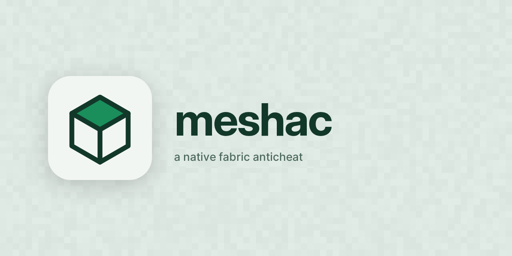

  

# meshac

a native anticheat for fabric servers. it runs on the server, players install nothing, and it's free.

it catches what a server can see. it doesn't flag people who are just playing. that second part is the whole point.

> **beta, not released yet.** everything here is what's been tested so far, misses included. numbers marked `[slot]` are still moving and get filled in when they settle.

## why this exists

the anticheats i tried either missed hacks or banned honest players for having bad wifi. the second one's worse. a missed hack costs you a bad afternoon, a false ban costs you a player who doesn't come back.

so the bar for meshac is simple. if a cheat leaves a trace the server can see, catch it. if it's a real player lagging, don't touch them. zero false flags is the goal, and every check has to prove it against a clean control before it ships.

## what it does

meshac watches movement, combat, building, mining, interaction and elytra flight. it works out what vanilla physics would allow and steps in when the two don't match.

it doesn't punish one weird packet. every flag adds heat to a player and the heat cools off on its own. a lag spike, or a laggy tunnel bunching packets up, doesn't add up to a removal. real cheating does, fast.

1. the player gets put back
2. then held for a moment
3. then kicked, and repeat offenders get tempbans that grow each time (10 minutes, 1 hour, 6 hours, 36 hours, up to 7 days)

permanent bans are off unless you turn them on.

## what it's caught so far

tested against real hacked clients (wurst on 26.3 and 26.1.2, meteor on 26.2) on a throwaway server, with a clean hack-off run next to every one.

flight, speed above sprint-jump pace, step, spider, jesus, fast climb, no slow, timer, blink (0.75 s and up), slippy, air jump, high jump, elytra fly and boost, reach, kill aura, criticals, crystal aura, anchor aura, auto totem, nuker, packet mine, ghost hand, auto clicker.

legit play hasn't flagged in any control run: sprint-jumping, wind charges, tnt and crystal knockback, elytra, hand mining through tunnels, lag spikes and a laggy proxy.

## what it doesn't catch

- speed at or below sprint-jump pace. it looks exactly like a fast legit player, so meshac doesn't pretend
- short blink (about 0.4 s)
- surround
- bow aimbot
- boosts above 45 blocks per second
- explosion knockback is exempt on purpose, because legit players get launched by explosions all day

some modules just haven't been run yet. that list lives in [docs/coverage.md](docs/coverage.md).

i also found checks of my own that never fired. the sign text rule and the chat command rule were hooked on the wrong thread, so they sat there doing nothing. both are fixed now and tested with scripted bots. that's written up in the false-positives doc because it's the exact kind of thing that makes a clean test run meaningless.

## install

1. get a jar for your minecraft version (see below)
2. drop it in your server's `mods` folder next to [fabric api](https://modrinth.com/mod/fabric-api)
3. start the server. `config/meshac.json` gets written with every default so you can see each knob

players install nothing.

**start in monitor mode.** set `monitorOnly` to `true`. it logs and alerts but never kicks or bans. watch what it flags on your own server for a bit, then turn punishment on.

| minecraft | jar | java |
| --- | --- | --- |
| 1.21.11 | `meshac-1.21.11.jar` | 21 |
| 26.1.2 | `meshac-26.1.jar` | 25 |
| 26.2 | `meshac-26.2.jar` | 25 |
| 26.3 | `meshac-26.3.jar` | 25 |

fabric api is required on all of them. no releases are published yet. to build one yourself, see [building](#building).

## for admins

all `/mesh` commands are op only.

| command | what it does |
| --- | --- |
| `/mesh cases` | recent cases |
| `/mesh case <id>` | what happened and why |
| `/mesh status <player>` | a player's heat, offences and what happens next |
| `/mesh watch` | flags in chat as they happen |
| `/mesh monitor` | shows whether monitor mode is on |
| `/mesh kick`, `/mesh ban` | manual removal |
| `/mesh pardon <case id>`, `/mesh unban <player>` | lift a case or a ban |
| `/mesh reload` | reload the config |

there's an optional discord webhook for holds and removals.

config reference

`config/meshac.json`, written with defaults on first start. three presets, `lenient`, `default` and `strict`. any knob left null follows the preset, set one to override just that knob.

| key | what it does |
| --- | --- |
| `preset` | `lenient`, `default` or `strict` |
| `monitorOnly` | log and alert, never kick or ban |
| `permanentBan` | false caps the ladder at the longest tempban |
| `holdAt`, `removeAt` | heat at which a player is held, and removed |
| `halfLifeSeconds`, `heatCoolSeconds` | how fast heat cools |
| `kicksBeforeTempban` | kicks before the first tempban |
| `tempbanBaseMinutes`, `tempbanGrowth`, `tempbanMaxMinutes` | the tempban ladder |
| `offenceHalfLifeDays`, `offenceMemoryDays` | how long old offences count |
| `requireClusters`, `requireClustersTierA` | independent causes needed before removal |
| `discordWebhook`, `discordOnHold` | webhook url (empty is off) and whether holds post too |
| `appeal`, `serverName`, `accent`, `warn` | the text and colours players see |
| `fixPistonWater` | patches MC-130183, the sticky piston flood machine bug. off by default |
| `veilXray`, `veilEsp` | anti-xray and anti-esp. off until proven on a real client |
| `clientFingerprintEnabled` | optional client brand hints. off by default, and it never punishes anyone on its own |

how removal actually works, and why a legit player can't reach it, is in [docs/PUNISHMENT-DESIGN.md](docs/PUNISHMENT-DESIGN.md).

coverage by hack

the full per-module tables, with times, holds and kicks:

- [docs/coverage.md](docs/coverage.md) for wurst
- [docs/COVERAGE-METEOR.md](docs/COVERAGE-METEOR.md) for meteor

`0 signals` only counts as a miss when the hack visibly acted. if it didn't, the row says unproven, not passed.

`[slot]` final caught / flagged / missed counts go here once the module tail is done.

how it's tested

`rig/` is a throwaway server and real clients on a docker network with no internet. it runs real wurst and meteor clients, scripted bots for packet-level tests, and a lag proxy that stalls and bunches packets so laggy connections get tested on purpose.

the rules for any new check:

- it ships with a test that shows it catching the hack
- and a test that shows it leaving legit play alone
- measure first, never tune blind

see [rig/README.md](rig/README.md). the false positives we found and fixed, with the numbers, are in [docs/FALSE-POSITIVES.md](docs/FALSE-POSITIVES.md).

false positives we've hit

every one gets written up: what flagged, why, and what the fix does. the short list so far is tunnel mining that looked like a nuker, a block broken "through" another when the hand just grazed a wall edge, and mining checks that tripped under lag. the long version is in [docs/FALSE-POSITIVES.md](docs/FALSE-POSITIVES.md).

per-version notes

one source tree builds for 1.21.11, 26.1.2, 26.2 and 26.3. the 1.21.11 jar uses the older obfuscated toolchain and runs on java 21, the rest need java 25. `rig/smoke.sh` boots each jar on a real server of its version.

most of the real-client testing is on 26.3 and 26.1.2. the other versions build and boot with meshac loaded, and `[slot]` full client coverage per version gets filled in as it's tested.

## building

you need java 25.

    ./gradlew build

the jar ends up in `build/libs/`. `build-all.sh` builds every version into `dist/`. to build for one version, pass `-Pminecraft_version=... -Pfabric_api_version=...` (see `gradle.properties` and `versions/`).

## the words

- a **signal** is one check catching something
- **heat** is a player's recent signals, and it cools off
- a **trace** is the evidence behind a signal
- a **ward** is an exemption

## docs

- [docs/PRINCIPLES.md](docs/PRINCIPLES.md) how code gets written here
- [docs/PUNISHMENT-DESIGN.md](docs/PUNISHMENT-DESIGN.md) the heat and ladder math
- [docs/IDENTITY.md](docs/IDENTITY.md) how it should feel
- [docs/coverage.md](docs/coverage.md) and [docs/COVERAGE-METEOR.md](docs/COVERAGE-METEOR.md) what's caught
- [docs/FALSE-POSITIVES.md](docs/FALSE-POSITIVES.md) what went wrong and how it got fixed

## license

gnu affero general public license v3.0 only, see [LICENSE](LICENSE). use it, change it, share it. if you distribute it or run a modified copy for others over a network, share your changes under the same license and keep the copyright notices.
